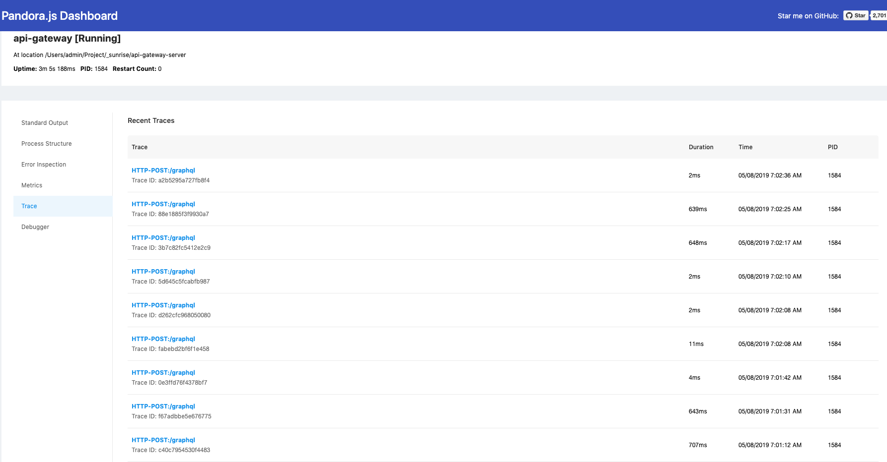
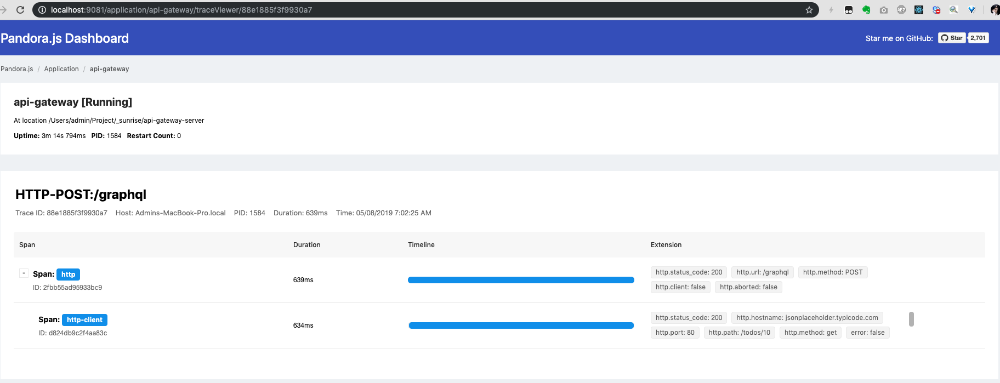
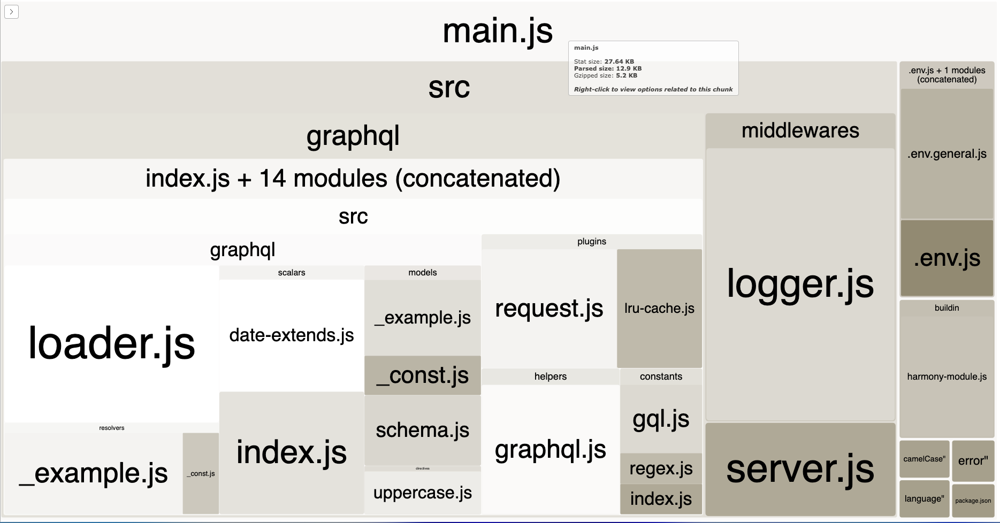
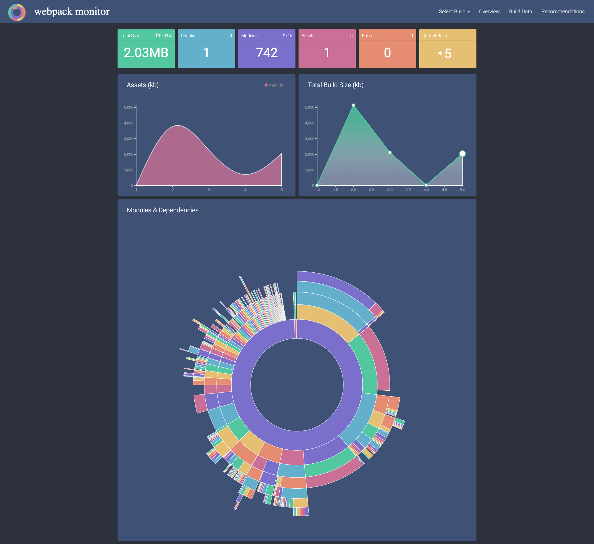

# API Gateway Server

> As https://nodesecurity.io/advisories/550, not recommended to use pandora-dashboard. New query to node.js online monitoring.

> Cannot build node_modules within the bundle file. X

## Guide

### Development

1. install node v8.10 [latest version supported by aws lambda]
2. (optional) Install [playground](https://github.com/prisma/graphql-playground/releases)
3. `npm i`
4. create specific env file `/env/.env.{ANYTHING}.js`, e.g. `.env.region.js` refer to `./.env.tpl`
5. `npm run setenv region`

6. ```bash
    # if run with playground app
    npm run dev:all
    # or
    npm run dev # then visit localhost:8000/graphql
    npm run server # alternative

    # if run serverless-offline
    npm run handler # then visit localhost:8000/playground

    # normal deploy
    npm run build

    # deploy to aws
    npm run deploy

    # Visualize module size
    npm run analyze # make sure you config EXCLUDE_MODULES properly
    npm run webpack:monitor # alternative

    # run with pandora monitor on production
    npm run start:pandora
    npm run start:monitor
    ```

### Visualization

- pandora monitor
  
  
  

- analyze (exclude node_modules)
  
  

  alternative (include node_modules, via webpack-monitor)

  

### Benchmark (to be done)

### Test (to be done)

### ESLint + prettier + babel setup

- Modules required
  
  `npm i -D eslint prettier babel-eslint prettier-eslint`, and any plugins / configs used in `.eslintrc.js`
- VSCode Settings
  1. install plugins: `eslint`, `prettier`
  2. any issue check `OUTPUT` (tab besides `TERMINAL`)
  3. modify settings.json

  ```json
  // NOTE switch off internal format that is conflict with eslint.autoFixOnSave
  "editor.formatOnSave": false,
  //eslint
  "eslint.enable": true,
  "eslint.autoFixOnSave": true,
  "eslint.validate": [
    "javascript",
    "javascriptreact",
    "typescript",
    "typescriptreact"
  ],
  // prettier
  "prettier.eslintIntegration": true,
  ```

- [Reference of Rules](https://eslint.org/docs/rules/)

## Todo List

- server
  - [ ] get cost-analysis alternative like [graphql-cost](https://github.com/iamake/graphql-cost), [graphql-validation-complexity](https://github.com/4Catalyzer/graphql-validation-complexity)
  - [ ] [deploy] serverless deployment to amazon
  - [ ] [dev] explore other graphql validationRules
  - [ ] [benchmark] tunning nodejs with `npm i -D autocannon 0x`: search and github nearform/slow-rest-api

- client
  - [ ] Add Relay in CRA
  - [ ] Relay mock data
    - [graphql-anywhere](https://www.npmjs.com/package/graphql-anywhere)
  - [ ] [how to use fragments in relay](https://www.apollographql.com/docs/react/advanced/fragments)
  - [ ] react-native-animatable
  - [ ] state management floway rxjs effector
  
- web only
  - [ ] client set head `Accept-Encoding: gzip`
  - [ ] polyfill from Financial Time `<script src="https://cdn.polyfill.io/v2/polyfill.min.js"></script>`

- app only
  - [ ] code push: https://github.com/rccoder/blog/issues/27

- global
  - Typescript packages added for potential usage

    ```bash
    npm i -D typescript @babel/preset-typescript serverless-plugin-typescript ts-node @types/lodash @types/node
    npm i -S serverless-plugin-typescript
    ```

### Web

## Other Reference list

- [react-redux-graphql-apollo-bootstrap-webpack-starter](https://github.com/MacKentoch/react-redux-graphql-apollo-bootstrap-webpack-starter)
- [Why use connections](https://blog.apollographql.com/explaining-graphql-connections-c48b7c3d6976)
- [babel macro](https://medium.freecodecamp.org/using-babel-macros-with-react-native-8615aaf5b7df)
- [node_graphql_apollo_template](https://github.com/brianschardt/node_graphql_apollo_template)

## Known issues

- include node_modules build failed due to apollo-server-koa -> node-fetch 